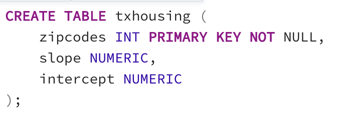
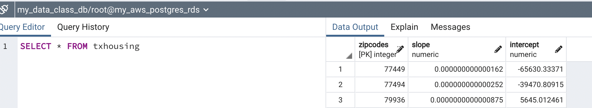
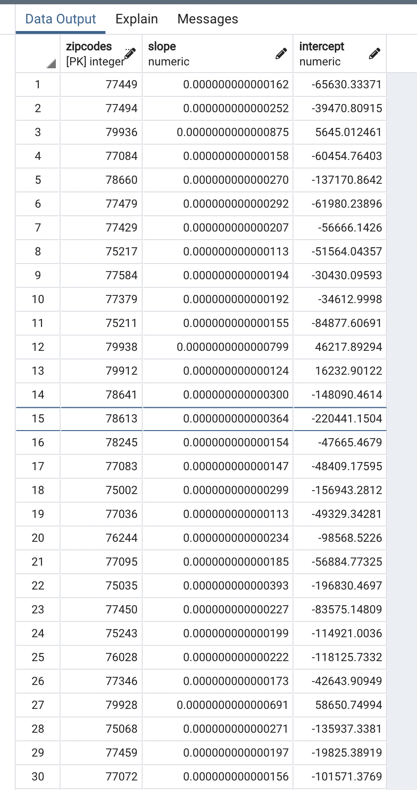

Utilizing AWS’s relational database (the largest cloud provider in the market today), we set up and connected a Postgres database. 

PostgreSQL, usually referred to as “Postgres,” is an object-relational database system that uses the SQL language.  

•	Created a PostgreSQL Database in relational database (RDS) in AWS

•	Created S3 bucket and stored data on AWS Simple Storage Service (Amazon S3)

•	Connected an RDS to pgAdmin

		1.	Registered server using the endpoint connectivity link from AWS
		2.	Created table in pgAdmin 
				.
		3.	Imported data into the table
		4.	Read table 
				.
				.

